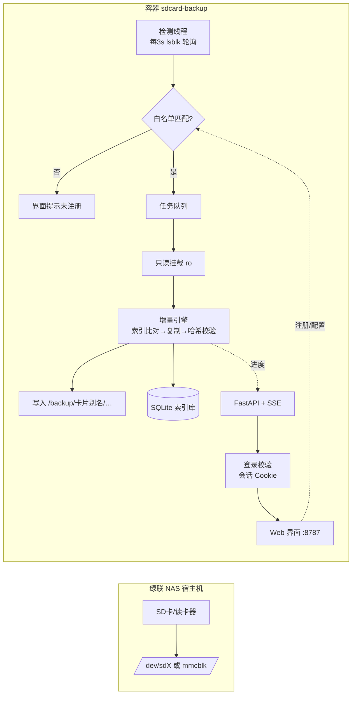

# 设计文档：存储卡自动备份（sdcard-backup）

本文回答"这个 Docker 程序为什么这么设计"，重点记录关键技术决策的备选方案与取舍。
部署步骤见 [README](../README.md)。

---

## 1. 需求拆解

原始需求 → 4 个可独立解决的技术子问题：

| 需求 | 技术子问题 |
|---|---|
| 插卡就开始备份，全自动 | **设备检测**：容器里如何知道"卡插进来了" |
| 可以识别具体的卡，只备份这张 | **身份识别**：怎样稳定区分"同一张卡"与"另一张卡" |
| 增量备份照片视频到指定文件夹 | **增量引擎**：如何判断哪些是新文件；如何保证完整性 |
| 图形界面管理与查看状态 | **状态服务**：实时进度、历史记录、白名单管理 |

---

## 2. 关键技术决策

### 2.1 设备检测：容器内如何发现插卡

| 方案 | 原理 | 评价 |
|---|---|---|
| udev netlink 事件 | pyudev 监听内核事件 | ❌ 容器内拿不到宿主 udev 的事件流，需要把宿主 udev 搬进容器，复杂且脆弱 |
| 宿主 udev 转发脚本 | 宿主机装 udev 规则转发事件进容器 | ❌ 需要改动 NAS 宿主系统，升级易失，违背"容器化封装"初衷 |
| inotify 观察 `/dev/disk/by-uuid` | 观察 udev 生成符号链接的目录 | ⚠️ 可行（bind `/dev` 时变化可见），但依赖挂载传导细节，不同 Docker/内核版本行为有差异 |
| **lsblk 轮询（采用）** | 每 3 秒执行 `lsblk --json` 对比前后差异 | ✅ 毫秒级开销、零外部依赖、行为完全可预测；只要求映射 `/dev` 和 `privileged` |

**结论**：轮询间隔通过界面可调（默认 3 秒），对"插卡后数秒内自动开始备份"的体验目标完全够用，
换来的是部署极简与强健壮性。过滤逻辑只关注 `tran in (usb, mmc)` 或 `mmcblk*` 的设备，
天然排除 NAS 内部 SATA/NVMe 数据盘。

### 2.2 卡片身份识别

设备节点名（`/dev/sda1`）会随插入顺序变化，**绝不能作为身份**；
USB 读卡器的序列号是读卡器自己的，**不能代表卡**。采用优先级链：

1. **SD 卡 CID 序列号**（内置卡槽 mmcblk，读 `/sys/block/mmcblkX/device/serial`）——最可靠，就是卡本身
2. **分区文件系统 UUID**（USB 读卡器场景，来自 lsblk 的 UUID 列）
3. **PARTUUID**（兜底）
4. 卷标 + 容量（仅展示用）

匹配白名单时使用**候选 ID 集合**（`mmc:…` / `fs:…` / `part:…` 一起比对），
确保同一张卡在"内置槽 ↔ USB 读卡器"之间移动也不丢注册。
多分区卡的现实处理：取容量最大的受支持分区为主分区，其余分区记录在案（不备份）。

**已知限制**：卡重新格式化后 UUID 会变，需要重新注册（这是文件系统层的事实，无解）。

### 2.3 挂载策略

- **一律只读挂载**（`ro,nodev,nosuid,noexec`），从机制上保证程序不可能写坏卡
- 容器内挂载是容器私有命名空间，不污染 NAS 宿主
- 三级回退链：
  1. 容器自己只读挂载（最干净）
  2. 宿主已挂载但挂载点也在容器内可见（用户映射了 `/mnt/@usb`）→ 直接只读读取
  3. 都失败 → 明确报错并给出处理建议（弹出卡 / 映射挂载点）
- 启动任务前清理上次异常退出残留的挂载点；任务结束按设置卸载或保持挂载（供手动卸载按钮）

### 2.4 增量与完整性

**索引即真相**。SQLite `files` 表按 `(card_id, relpath)` 记录 `大小 + mtime + 哈希 + 目标路径`，
判断逻辑：

- 索引中状态为 done 且 大小相同、mtime 差异 ≤2 秒（FAT 时间戳精度）→ 跳过
- 否则列入待复制清单

复制流程保证完整性：

1. 单次读取源文件：边复制边计算 `blake2b-128` 哈希（省一次全量读盘）
2. 写入临时文件 `.part` → `fsync` → 原子 `rename`，中途失败不留半个文件
3. 保留原文件 mtime（照片工具排序友好）
4. 可选重读目标文件比对哈希（默认开启）→ 防"静默写坏"

**冲突策略**：目标已存在同名文件时——
大小相同视为已备份（复用）；不同则追加 `__2/__3` 后缀，**绝不覆盖**已有备份。

**断点续传是自然结果**：索引按 25 个文件一批落库，拔卡中断后重插，未完成文件自动补差集。

**空间预检**：复制前用 `statvfs` 预检目标剩余空间（保留 1% 余量），不足直接中止而非写一半失败。

### 2.5 落盘组织

- `date` 模式（默认）：文件名日期 → EXIF → mtime 三级推断，落到 `YYYY/MM/DD/文件名`
- `mirror` 模式：完整保留卡内相对结构（`DCIM/100CANON/…`）
- 每张卡独立子目录（`/backup/{别名}/`），互不干扰；同名不同卡天然隔离

---

## 3. 数据模型（SQLite，WAL 模式）

```
cards    (id, alias, dest_subdir, organize, enabled, all_files, include_globs,
          exclude_globs, fs_uuid, fs_label, fs_type, reader_serial, card_size,
          created_at, last_seen_at, last_backup_at, note)
files    (card_id, relpath, size, mtime, hash, dest_rel, status, backed_up_at)  PK(card_id, relpath)
tasks    (id, card_id, card_alias, trigger, status, phase, started_at, finished_at,
          total_files, done_files, total_bytes, done_bytes, skipped_*, error_count, result, error)
task_errors (id, task_id, relpath, message, at)
settings (k, v)   -- JSON 编码的键值对，界面可改
users    (username PK COLLATE NOCASE, pass_hash, is_admin, enabled, must_change,
          created_at, last_login_at, last_login_ip)
sessions (token PK, username, created_at, expires_at, ip, ua)   -- 登录会话
```

## 4. 任务状态机

```
入队(queued) → 等待设备就绪 → 只读挂载 → 扫描文件 → 比对索引 → 备份中 → 卸载 → 完成(done)
                    │              │                                   │
                    └──────────────┴────── 拔卡/用户取消 ──→ 已中断(interrupted)
                                          异常 ──→ 失败(failed)
```

单工作线程串行执行（同一时刻只有一张卡在备份）；插卡、手动、重试三种触发统一走同一队列。

## 5. 运行时架构



## 6. 安全设计

| 风险 | 对策 |
|---|---|
| 恶意文件名目录穿越（`../../`） | 所有目标路径逐段清洗 `safe_relpath`，拒绝 `..`/绝对路径/控制字符 |
| 写坏存储卡 | 只读挂载 + 程序无任何写卡代码路径 |
| 误删源文件 | 程序只读取卡，无删除逻辑；"备份后删除"功能刻意不做 |
| 覆盖已有备份 | 同名不同内容一律加后缀，不覆盖 |
| 界面被局域网乱用 | 用户名密码登录 + HttpOnly 会话 Cookie（详见 6.1）；README 明确禁止公网暴露 |
| 权限过大 | `privileged` 仅服务 `mount/umount`；不写宿主文件（除映射的 data/backup） |

### 6.1 登录与账号

- **密码存储**：`hashlib.pbkdf2_hmac`（PBKDF2-HMAC-SHA256，20 万次迭代 + 16 字节随机盐），
  落库格式 `pbkdf2_sha256$<迭代>$<盐>$<摘要>`；校验用 `hmac.compare_digest` 常量时间比较。
  仅标准库实现，不新增依赖。
- **会话**：随机 `token_urlsafe(32)` 存 `sessions` 表，浏览器只保存 HttpOnly + SameSite=Lax Cookie；
  默认 7 天，剩余不足一半时滑动续期；改密/重置密码即删除该用户全部会话。
- **鉴权中间件**：除 `/login`、`/api/auth/login`、`/api/auth/state`、`/api/health`、`/static/*` 外，
  一律要求有效会话 —— 页面请求 302 跳登录页，接口请求 401。
- **首登强制改密**：初始管理员（`users` 表为空时自动创建 `admin/admin`）与新建/被重置密码的账号
  都带 `must_change=1`；此时拦截除 `/api/auth/*` 外的所有接口（403），前端渲染不可关闭的修改层。
  改密必须同时更换用户名，避免默认账号名继续存在。
- **越权与误操作防护**：登录失败限速（同 IP 5 分钟 8 次，进程内存态）；不能删除/停用当前登录账号；
  任何操作后都必须保留至少一个启用状态的管理员；用户 CRUD 接口仅管理员可用。
- **语言**：登录页与用户管理文案同样走 `app/i18n.py` + `static/i18n.js` 双份字典；登录失败原因
  由后端按 `?lang=` 渲染后返回，前端直接展示。

## 7. 已知限制与可扩展方向

**当前限制**

- 单任务串行：同时插两张卡时第二张排队（家用场景足够）
- 同卡重新格式化后 UUID 变化，需重新注册
- 视频"拍摄时间"无 EXIF 兜底时按文件名/mtime 推断（未引入 ffprobe 依赖）
- Windows 开发环境无 `lsblk`，设备检测自动暂停（部署目标为 Linux NAS，不受影响）

**可扩展**

- 多读卡器并行（按设备分工作线程）
- 跨卡内容去重（哈希已在库中，加一个全局索引即可）
- 邮件/钉钉通知（当前已预留通用 Webhook）
- 备份完成后的缩略图预览页
